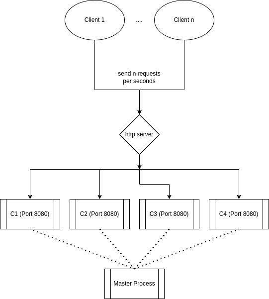
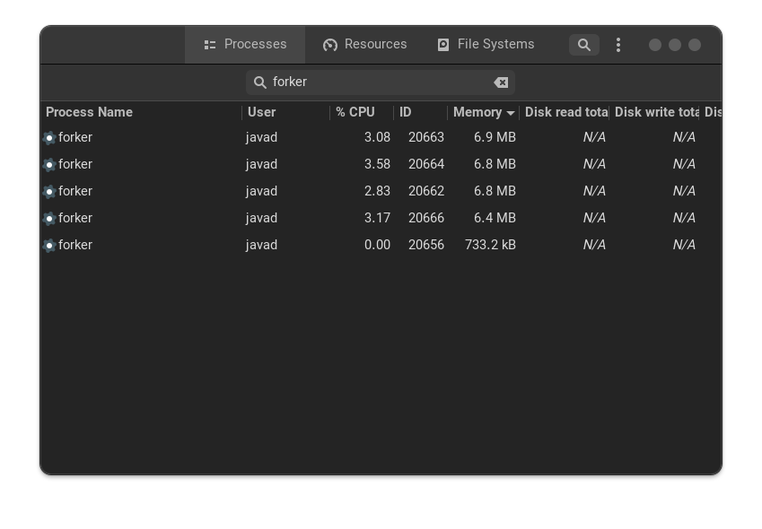

# forker
[](https://pkg.go.dev/github.com/Ja7ad/forker)

Get high performance http requests with fork process (forker inspired prefork feature in web servers)

prefork is a solution which is also used by other webservers

A server instance is opened for each processor core and incoming requests are shared between these instances

In order to distribute the load more evenly and handle more requests per second, there is a master that starts by the user, which then starts child processes on the other processor cores based on configuration

memory between the different processes is not shared, beacuse  goroutines are independent processes



# how to install

```shell
go get -u github.com/Ja7ad/forker
```

## forker benchmark

forker tested 500 concurrent with 200k http requests



```shell
oha -c 500 -n 200000 --latency-correction --disable-keepalive http://localhost:8080
```

```shell
Summary:
  Success rate:	1.0000
  Total:	24.4907 secs
  Slowest:	0.5000 secs
  Fastest:	0.0004 secs
  Average:	0.0610 secs
  Requests/sec:	8166.3762

  Total data:	2.10 MiB
  Size/request:	11 B
  Size/sec:	87.72 KiB

Response time histogram:
  0.000 [1]     |
  0.050 [82408] |■■■■■■■■■■■■■■■■■■■■■■■■■■
  0.100 [98705] |■■■■■■■■■■■■■■■■■■■■■■■■■■■■■■■■
  0.150 [16180] |■■■■■
  0.200 [2245]  |
  0.250 [361]   |
  0.300 [59]    |
  0.350 [33]    |
  0.400 [3]     |
  0.450 [1]     |
  0.500 [4]     |

Latency distribution:
  10% in 0.0291 secs
  25% in 0.0404 secs
  50% in 0.0557 secs
  75% in 0.0754 secs
  90% in 0.0989 secs
  95% in 0.1170 secs
  99% in 0.1581 secs

Details (average, fastest, slowest):
  DNS+dialup:	0.0259 secs, 0.0001 secs, 0.3010 secs
  DNS-lookup:	0.0000 secs, 0.0000 secs, 0.0239 secs

```

## Example

### http server

```go
package main

import (
	"github.com/Ja7ad/forker"
	"log"
	"net/http"
)

func main() {
	srv := &http.Server{
		Handler: GreetingHandler(),
	}

	f := forker.New(srv)

	log.Fatalln(f.ListenAndServe(":8080"))

}

func GreetingHandler() http.HandlerFunc {
	return func(w http.ResponseWriter, r *http.Request) {
		w.Write([]byte("greeting!!!"))
	}
}
```

### echo framework

[benchmark](_example/echo)

```go
package main

import (
	"github.com/Ja7ad/forker"
	"github.com/labstack/echo/v4"
)

func main() {
	f := forker.NewEchoForker()
	e := f.GetEcho()

	e.GET("/", Greeting)

	e.Logger.Fatal(f.Start(":8080"))
}

func Greeting(c echo.Context) error {
	return c.String(200, "greeting")
}

```